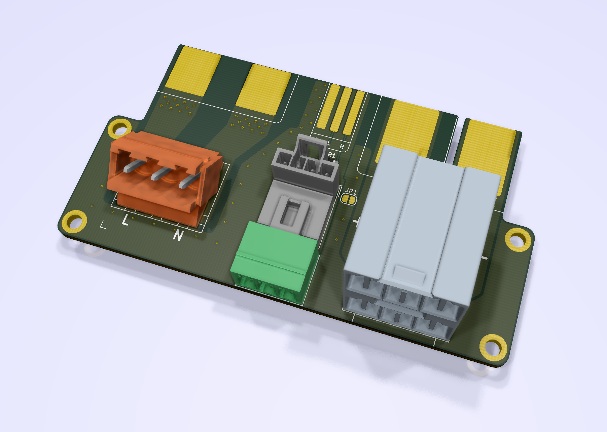

# EltekFlatpack2

This is my take on the Eltek Flatpack2 HE AC PSU adapter board (may also work with the DC-DC units); it's got a few nice features I like, like a plethora of connectivity options.

I've probably made some really bad design choices here, please don't judge me.

## Features
I probably went a little bit overboard with connector options, but I wanted it to be flexible.

JP1 is a solder jumper that connects VOUT+ to J2 pin 1.
R1 is an optional 120R CANBUS termination resistor.

### AC Input footprints:
  - Standard 5.08mm-pitch pluggable terminal block of various kinds (5.0mm ones with small-ish pins should be able to squish into this as well)
  - WAGO 256-series (and similar) push-button actuated adjustable-pitch terminal blocks

### Controller CANBUS footprints:
- 4-pin 0.1" footprint with pinout VOUT+ CANH CANL GNDD.
  - 4P vertical Molex Nano-Fit [series 106309-1x04](https://www.molex.com/molex/search/deepSearch?pQuery=q%253D*%253A*%2540fq%253Dcollection%253Aimpulse%2540fq%253Dcollection%253Aimpulse%2540fq%253Dproductseries%253A%2522105309%2522%252BOR%252Bengineeringnumber%253A%2522105309%2522%2540fq%253Dcategory%253A%2522PCB%252BHeaders%2522%2540fq%253Dcircuitsloaded%253A%25224%2522&currentQuery=colorresin%3ABlack&origin=_l1stv13w)
  - 4P horizontal Molex Nano-Fit [105313-1x04](https://www.molex.com/molex/search/deepSearch?pQuery=q%253D*%253A*%2540fq%253Dcollection%253Aimpulse%2540fq%253Dcollection%253Aimpulse%2540fq%253Dproductseries%253A%2522105313%2522%252BOR%252Bengineeringnumber%253A%2522105313%2522%2540fq%253Dcategory%253A%2522PCB%252BHeaders%2522%2540fq%253Dcircuitsloaded%253A%25224%2522&currentQuery=colorresin%3ABlack&origin=_l1stv13w)
  - 3-pin vertical Molex Nano-Fit [106309-1x03](https://www.molex.com/molex/search/deepSearch?pQuery=q%253D*%253A*%2540fq%253Dcollection%253Aimpulse%2540fq%253Dcollection%253Aimpulse%2540fq%253Dproductseries%253A%2522105309%2522%252BOR%252Bengineeringnumber%253A%2522105309%2522%2540fq%253Dcategory%253A%2522PCB%252BHeaders%2522%2540fq%253Dcircuitsloaded%253A%25223%2522&currentQuery=colorresin%3ABlack&origin=_l1stv13w) keys into footprint pins 2-4. No controller power, like the secondary footprint.
- 3-pin 3.5mm footprint with pinout CANH CANL GNDD (no controller power)
  - Regular horizontal or vertical 3.5mm-pitch pluggable terminal block fits here.

### DC output footprints:
- TE Connectivity ELCON Mini 3P RA solder-in, [P/N 2204529-1](https://www.te.com/usa-en/product-2204529-1.html)
- TE Connectivity ELCON Mini 6P RA solder-in, [P/N 2204535-1](https://www.te.com/usa-en/product-2204535-1.html)
  - These will both take [P/N 2204534-1](https://www.te.com/usa-en/product-2204534-1.html) or [P/N 2204534-2](https://www.te.com/usa-en/product-2204534-2.html) plugs. Two fit into the 6-pin connector at the same time.
  - Contacts are TE's 5.8/6.3mm Standard Power Timer series, like [P/N 927837-5](https://www.te.com/usa-en/product-927837-5.html) and are rated for 35A per 3-pin set
- Amass XT60-PW solderable PCB-mount XT60 connector, commonly used for drone/RC shenanigans.
  - Rated at 30-60A depending on who you ask.
- The XT60-PW footprint also contains a 5.08mm terminal block pinout, and exposed pads for direct soldering.

## Repository Structure
- `EltekFlatpack2` contains the KiCad project
- `EltekFlatpack2/EltekFlatpack2.pretty` contains board-specific footprints
- `EltekFlatpack2/shapes3D` contains board-specific STEP models (and a few extra)

## Building
Simply call `make` in the top-top level directory. The `build` directory will then contain:

- the main board
- A panelized version of said board
- zipped gerbers for the boards you can directly use for manufacturing
- zipped gerbers and SMT assembly BOM/position files for JLCPCB's SMT assembly service for the single-board version.

Makefile uses [Jan Mrázek](https://github.com/yaqwsx)'s [KiKit](https://github.com/yaqwsx/KiKit), which I cannot recommend enough, and therefore has to be available on your system.

Jan's [jlcparts](https://yaqwsx.github.io/jlcparts/) app was also extremely useful in narrowing down part choices based on what JLCPCB have available.
